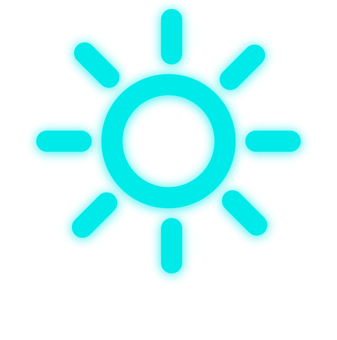
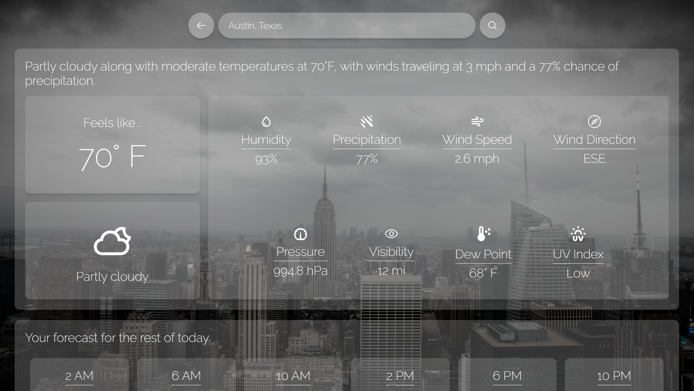
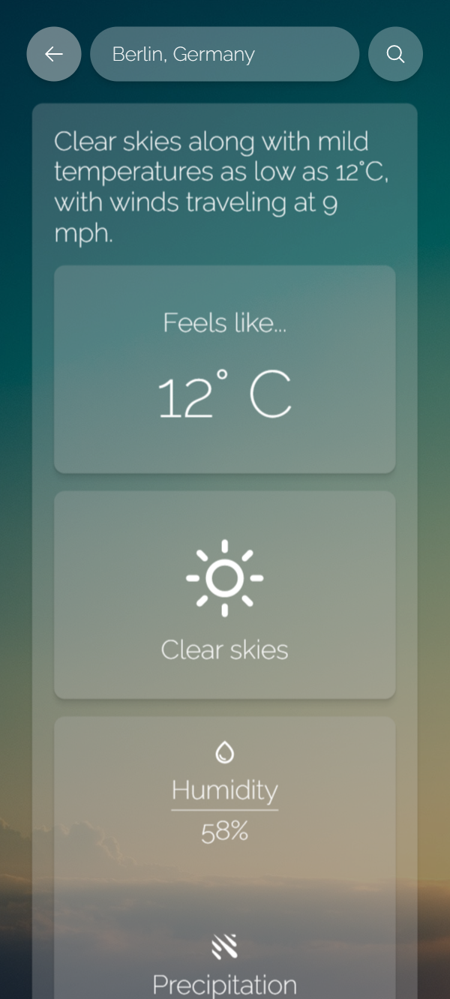

  

  A weather-reporting web application created in React.js

------
## **About the Project** 🔎

A web application that reports weather and temperature forecasts based on a given location.

Languages used: 

1. JavaScript
2. CSS

Modules/Libraries used:

1. [Axios](https://github.com/axios/axios)
2. [Redux & Redux Toolkit](https://github.com/reduxjs/redux)
3. [React Router v6](https://github.com/remix-run/react-router)

API's used:

1. [Geocode](https://geocode.maps.co/)
2. [Open-Meteo](https://open-meteo.com/)
3. [Type.fit](https://type.fit/api/quotes)

**Project development**: 3/29/2023 - 5/10/2023

## **Features** 📦️
- [x] Location search bar
- [x] Temperature unit toggling
- [x] Dynamic backgrounds
- [x] Current weather forecast
  * Current temperature
  * Weather type
  * **Weather properties:**
    * Humidity levels
    * Precipitation probability
    * Wind speed
    * Wind direction
    * Barometric pressure
    * Visibility
    * Dew Point
    * UV Index
- [x] Day forecast predictions
- [x] Week forecast predictions
- [x] Inspirational quotes

## **Screenshot** 📷
| Desktop | Mobile |
|:---:|:---:|
|  |   |

## **License** 📜
[**MIT**](https://github.com/KennethOnuorah/React-Weather/blob/master/LICENSE)